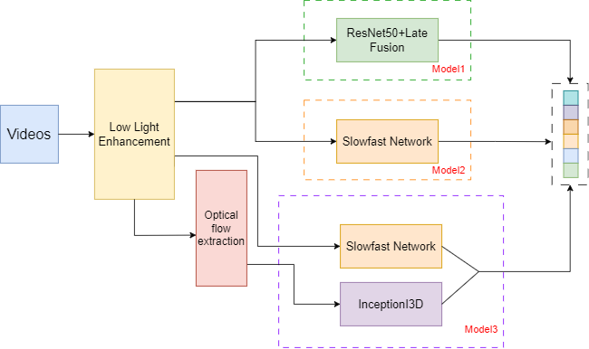

## Models about Video Human Action Recognition in the Dark

### Models

- ResNet50 + Late Fusion
- Slowfast Network
- Two-stream Network

</img>

### Dataset

- [Dataset (ARID)](https://xuyu0010.github.io/arid.html)

- [Dataset (ARID_UG2_2.1)](https://github.com/xuyu0010/ARID_UG2_2.1)

### Related Repositories

- [ARID_v1](https://github.com/xuyu0010/ARID_v1)

- [SlowFast](https://github.com/facebookresearch/SlowFast)
- [pytorch-i3d](https://github.com/piergiaj/pytorch-i3d)

### Related Papers

- [ARID: A New Dataset for Recognizing Action in the Dark](https://arxiv.org/abs/2006.03876)
- [SlowFast Networks for Video Recognition](https://arxiv.org/abs/1812.03982)
- [Quo Vadis, Action Recognition? A New Model and the Kinetics Dataset](https://arxiv.org/abs/1705.07750)